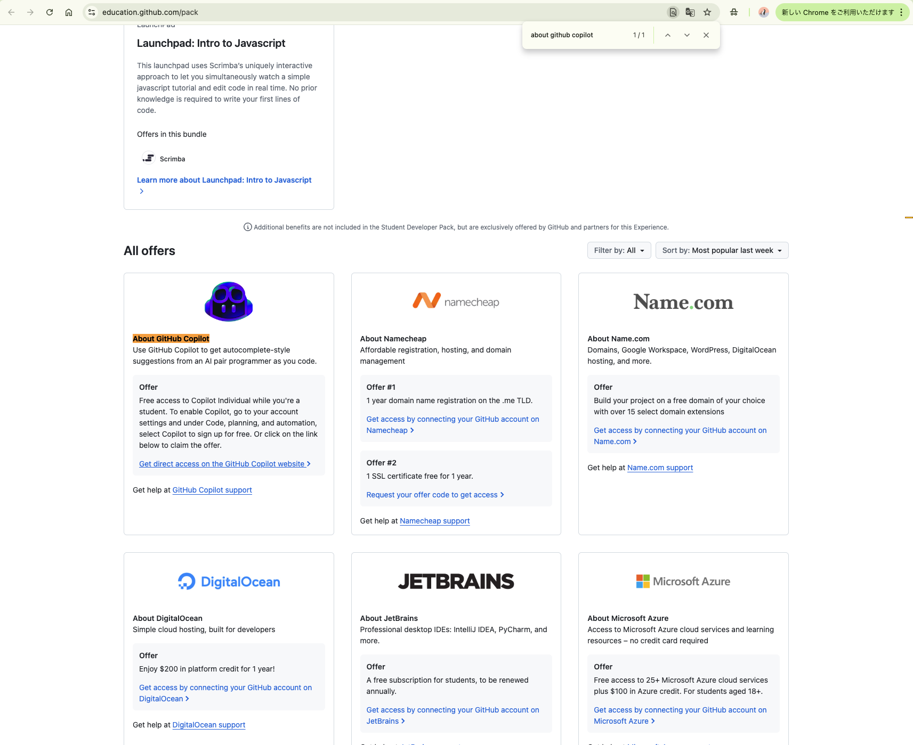

# GitHub Copilot Pro 有効化解決記録

このドキュメントは、GitHub Education の認証が完了し、プロフィールにPROバッジが表示されているにもかかわらず、GitHub Copilot の画面では「You are using Copilot for free」と表示され、Pro プランの機能が利用できなかった問題の解決方法をまとめたものです。  
本件の解決には、[GitHub Community Discussion](https://github.com/orgs/community/discussions/150580)を参考にしました。

## 背景

- **GitHub Education の認証**  
  対象者（学生・教職員）の場合、無料でGitHub Copilotが利用できる特典が提供されます。  
- **問題の内容**  
  プロフィール画面にはPROバッジが表示されているにもかかわらず、Copilot の利用画面では「You are using Copilot for free」と表示され、Pro プランとしての機能が有効になっていませんでした。
- ### **事前に試した解決策**
  #### 1. サインアウト＆再サインイン
  - **手順:**  
    VS Code または GitHub のウェブサイトから一度サインアウトし、同じアカウントで再サインインしました。  
  - **目的:**  
    アカウントの最新の認証情報が反映され、GitHub Copilot の認証情報が更新されることを確認するため。

  #### 2. キャッシュのクリア
  - **手順:**  
    VS Code のキャッシュや、必要に応じてブラウザのキャッシュをクリアしました。  
  - **目的:**  
    以前の古い認証情報やキャッシュデータが原因で、正しい設定情報が反映されない問題を解消するため。

  #### 3. VS Code の再起動
  - **手順:**  
    キャッシュクリア後、VS Code を完全に再起動しました。  
  - **目的:**  
    すべての変更と認証情報の更新が正しく有効になるようにするため。

  #### 4. 状態の確認
  - **手順:**  
    再起動後、GitHub Copilot の画面にて「GitHub Copilot Pro is active」と表示されるか確認しました。  
  - **結果:**  
    「You are using Copilot for free」の状態（解決できていない）

## 解決手順
### 1. ステータスの確認
  下記の状況に当てはまるかどうかを確認。
  - `PRO`バッジが付与されている（多くの場合、「Your profile」画面の左下`Highlights`に`PRO`というバッジの表記がある）
  - 「Your Copilot」画面にて、`Congrats! Your request for @username was approved and your benefits are now available.`というメッセージが来ている
  - 同じく「Your Copilot」画面にて、Github Copilotが「You are using Copilot for free」になっている。

### 2.  **pack offers page** へのアクセス
  [GitHub Student Developer Pack](https://education.github.com/pack)にアクセスする。

### 3. `All offers`セクションまでスクロール

  `About GitHub Copilot`内の<u>Get direct access on the GitHub Copilot website</u>にアクセス

### 4. 流れに沿って`Copilot`のFeatures等の設定を行う
  「Your Copilot」画面に遷移し、`Anthropic Claude 3.7 Sonnet in Copilot`等の設定を行うことができる。

### 5. 状態の確認
  GitHub Copilot Pro is active for your account と記載があれば完了。

## 備考
- **本件は、数日間待つことで自然に解決する場合があります。:**  
  筆者はGitHub Education承認メール（"Welcome! Thank you for joining GitHub Education. ..."）を受け取ってから2日後に対処しましたが、他の利用者の報告によると、4～7日間待機すると正常にGitHub Copilot Proが有効になるケースも見受けられます。

- **表示の違いについて:**  
  GitHub Education の対象者は、無料で Copilot を利用できる仕組みですが、環境や認証タイミングにより、場合によっては一時的に「Pro is active」と表示されるケースもあります。ただし、この無料提供は教育利用向けであり、商用利用向けのProプランとは異なる運用です。

- **問い合わせ先:**  
  万が一、上記手順で問題が解決しない場合は、GitHub サポートに連絡し、詳細な状況とアカウント情報を提供することをお勧めします。

## 参考リンク
  - GitHub Community Discussion: [https://github.com/orgs/community/discussions/150580](https://github.com/orgs/community/discussions/150580)
  - Github Copilotとは？: [https://www.ai-souken.com/article/github-copilot-overview](https://www.ai-souken.com/article/github-copilot-overview)

## 結論
  以上の手順により、GitHub Education 対象者として無料で提供されるCopilotが、正しくProプランの状態（機能が有効な状態）で動作するようになりました。
